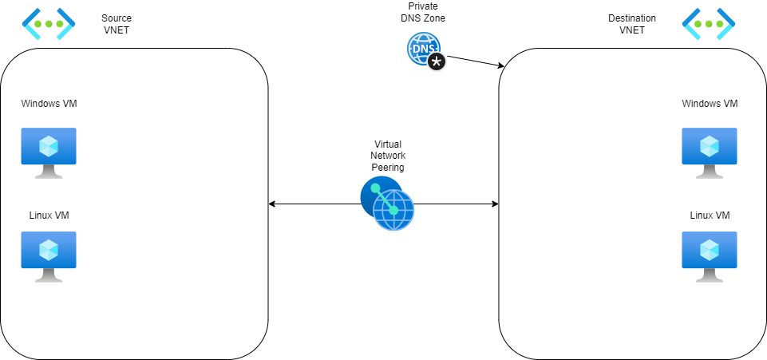

Lab environment for testing DNS

You may either clone this repro and deploy with Bicep or use the easy deploy below:

Diagram of the infrastructure

Note: This Diagram is in this repository, and can be modified via https://app.diagrams.net/
